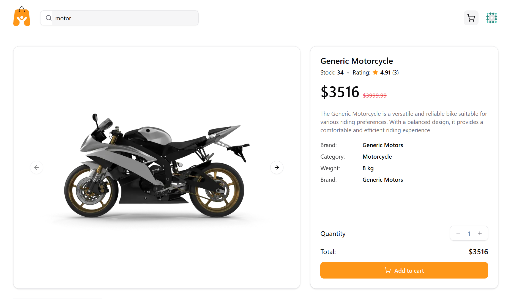
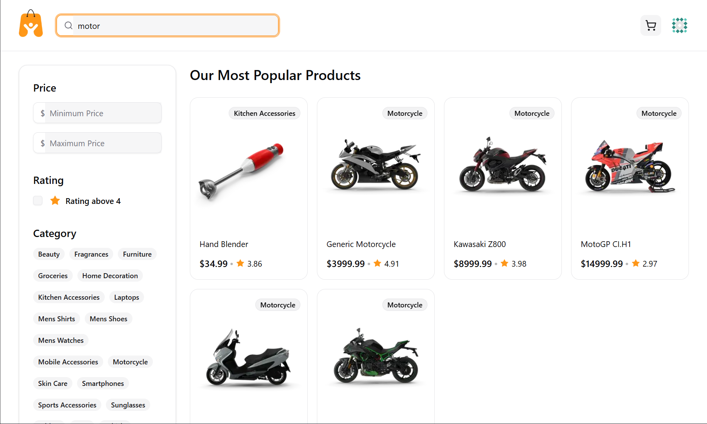
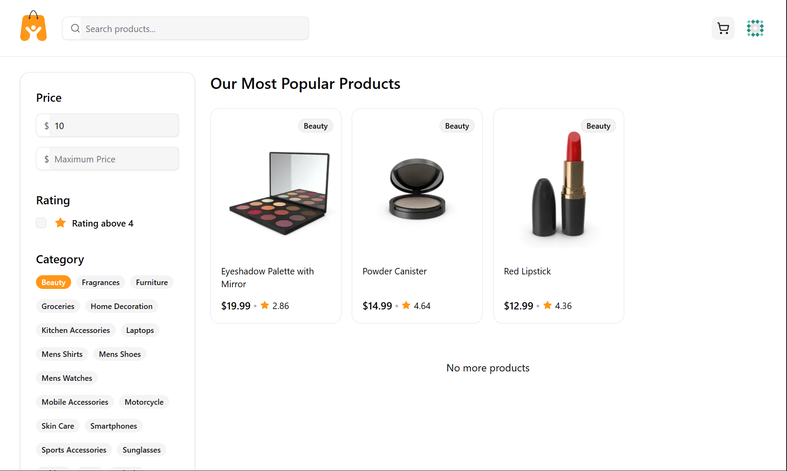
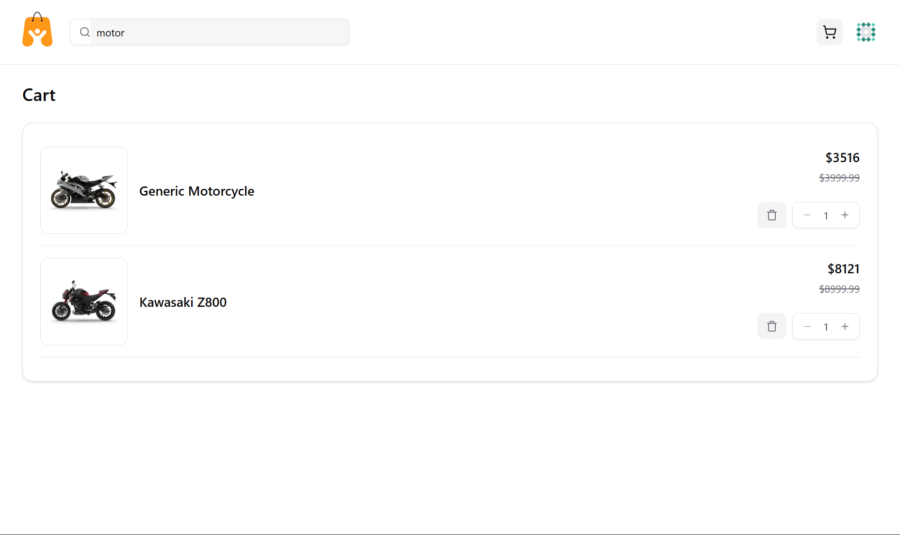

# E-Commerce Demo Project

**Live Demo:** https://ecommerce-ten-wine-28.vercel.app/

## Deskripsi Proyek

Proyek ini adalah aplikasi **e-commerce** sederhana yang dibuat sebagai bagian dari tes masuk kerja.
Tujuannya adalah membuat fitur utama toko online, termasuk **search**, **filter kategori**, dan **cart**.

**Catatan:**

* Menggunakan **[DummyJSON API](https://dummyjson.com/)** untuk data produk.
* DummyJSON tidak mendukung **filter lokasi**, sehingga fitur lokasi tidak diterapkan.
* Search dan filter kategori dibuat secara **manual di sisi client**.

---

## Fitur
* **Produk Detail**: Lihat produk detail dengan carousel dan deskripsi.
  
* **Search Produk**: Cari produk berdasarkan nama secara real-time.
  
* **Filter Kategori**: Pilih produk berdasarkan kategori yang tersedia.
  
* **Cart / Keranjang Belanja**:

  * Tambahkan produk ke cart.
  * Update quantity dengan debounce.
  * Hapus produk dari cart.
  * Cart disimpan di **localStorage** agar tetap ada saat refresh halaman.
    
* **Skeleton Loading**: Efek shimmer saat data sedang dimuat.
* **Responsive Layout**: Tampilan mobile & desktop friendly.
* **UI Modern**: Menggunakan **shadcn/ui + Tailwind CSS**.

---

## Teknologi

* **Frontend**: Next.js 16, React 19
* **UI Components**: shadcn/ui + Tailwind CSS
* **State Management**: React Hooks (`useState`, `useEffect`, `useMemo`, `useCallback`)
* **Data Storage**: LocalStorage untuk cart
* **API**: DummyJSON untuk produk

---

## Struktur Folder

```
├─ app/
│  ├─ (main)/
│  │  ├─ cart/
│  │  ├─ products/
│  │  └─ page.tsx
├─ components/
│  ├─ cart/
│  │  ├─ cart-item.tsx
│  │  └─ cart-skeleton.tsx
│  ├─ products/
│  │  ├─ filters/
│  │  ├─ product-card.tsx
│  │  └─ product-skeleton.tsx
│  ├─ ui/
│  └─ navbar/
├─ interfaces/
├─ lib/
├─ utils/
└─ public/images/
```

---

## Cara Menjalankan

1. Clone repository:

```bash
git clone <repo-url>
```

2. Masuk folder proyek:

```bash
cd <project-folder>
```

3. Install dependencies:

```bash
npm install
# atau
yarn
```

4. Jalankan development server:

```bash
npm run dev
# atau
yarn dev
```

5. Buka di browser:

```
http://localhost:3000
```

---

## Catatan Pengembangan

* Search dan kategori filter **di-handle client-side** karena DummyJSON API tidak mendukung filter kompleks.
* Cart menggunakan **localStorage**, sehingga data tetap tersimpan tanpa backend.
* Debounce quantity update untuk mengurangi penulisan berulang ke localStorage.
* UI menggunakan **shadcn/ui + Tailwind CSS**, sehingga tampilan modern, konsisten, dan mudah dikustomisasi.
* Skeleton loading menampilkan shimmer saat menunggu data produk dimuat, meningkatkan UX.

---

## Screenshot / GIF Placeholder

> Ganti placeholder dengan screenshot/GIF asli proyekmu:

* `./screenshots/search.png` → halaman search
* `./screenshots/filter.png` → kategori filter
* `./screenshots/cart.png` → cart page
* `./screenshots/product.png` → product page

Apakah mau aku buatkan versi itu juga?
